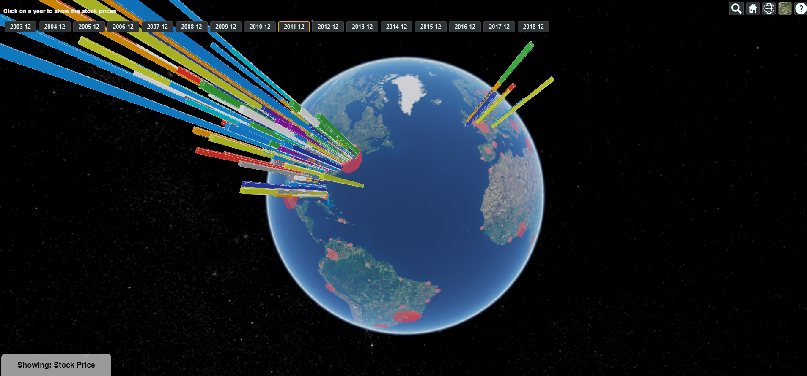

# global-stock-vis

Visualisation of NASDAQ stock data, from 2003 to 2018. Also shown as red circles for comparison are populations of cities.
This visualisation was created to compare price/density of companies performing well on the stock market with populations of cities around the world. It's also interesting just to look at stocks in a visual manner, much easier than stock sheets.

Created with [Kieran Frewen](https://github.com/kfrewen).

Hosted [here](https://global-stock-visualisation.appspot.com/).

## Setup
To run on your machine, you'll need [Node](https://nodejs.org/en/) installed

1. Download and unzip repo
1. Navigate into the project folder - `cd project` 
2. Run `npm install` to install the required packages
3. Run `node server.js` to start up the local server
4. Go to `localhost:8080` in your browser and use the visualisation.

Note: some of the data processing scripts require Google API credentials, these are not necessary for running the program so you only need them if collecting/processing extra data.